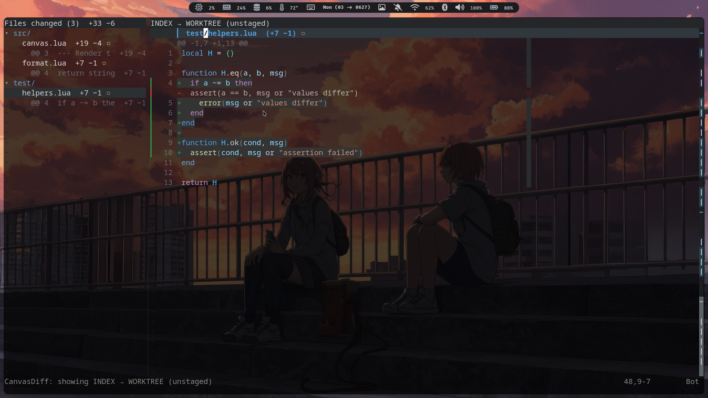
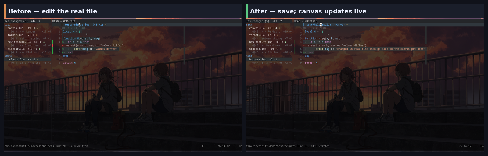
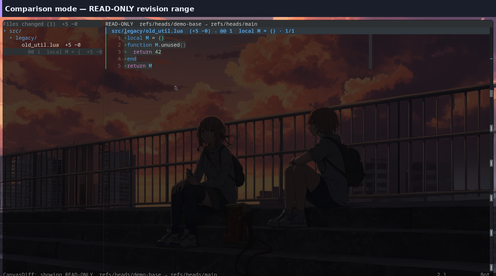
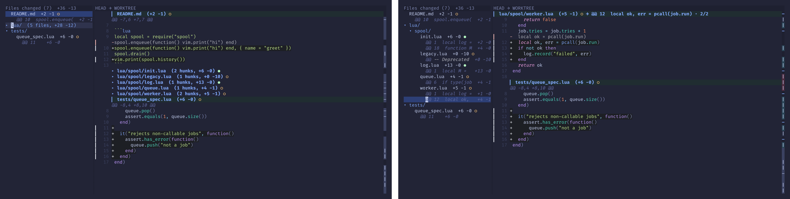
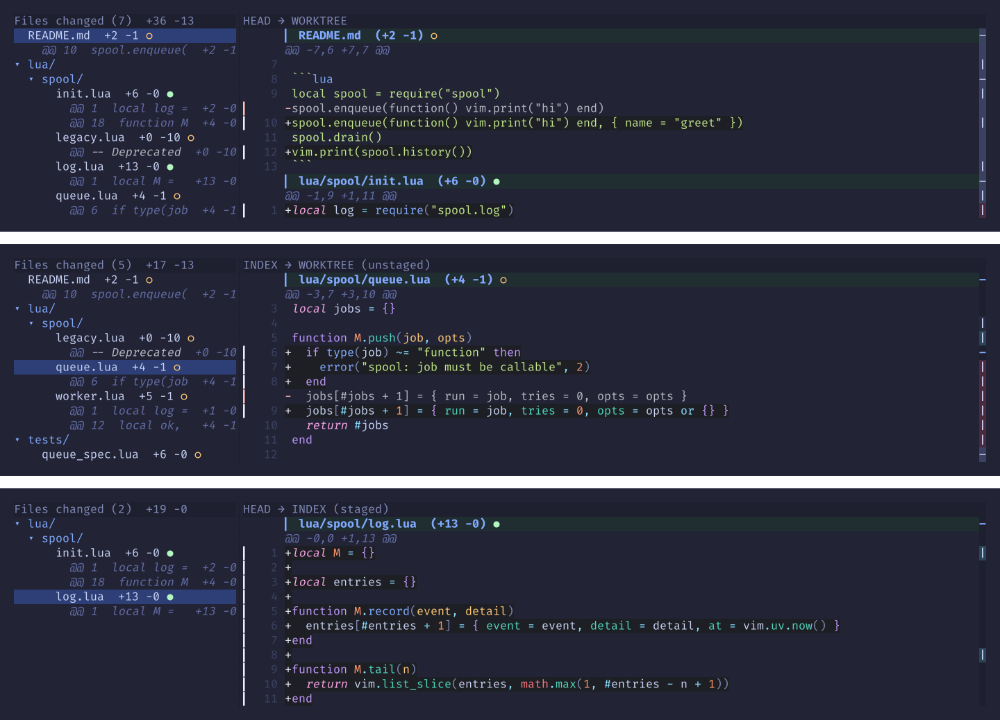
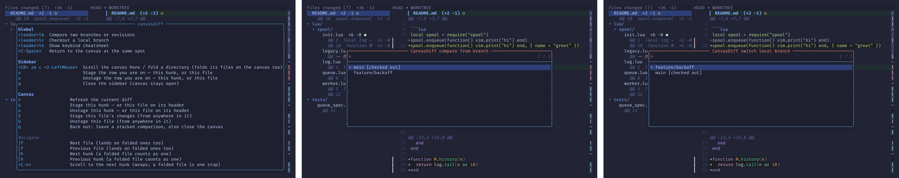

# canvasdiff.nvim

Your whole **Git Diff** (changeset) as one buffer you can work inside.

CanvasDiff renders every changed file into one scrollable canvas. Press Enter
on any line to open the real file with your LSP, Tree-sitter, autocmds, and
unsaved edits intact; edit it, then jump back to the same place in the review.

CanvasDiff is **pre-alpha**. Its behavior is tested, but the public surface may
still change before the first stable release.



### Screenshots

**1. Live edit — before / after**
Edit the real file, save, and the canvas refreshes in place.



**2. Comparison mode**
Read-only revision ranges without checking out branches.



**3. Sidebar fold & jump**
Left: `src/` folded to one summary. Right: Enter on a row jumps the canvas.



**4. Lens states**
All · unstaged · staged — same review, different filters.



**5. Key menus**
Help cheatsheet, compare picker, and checkout.



## Features

- One canvas for every changed file, with Tree-sitter highlighting.
- Exact jumps into real files and back, including unsaved buffer content.
- Live refresh on saves, focus changes, and external changes.
- All, unstaged, staged, and read-only revision-range lenses.
- Hunk/file staging, persistent folds, a file-and-hunk sidebar, pinned context,
  and a draggable minimap.
- Automatic virtualization and a page-backed canvas for very large reviews.

## Requirements

- Neovim 0.12 or newer. This is the tested and asserted floor.
- `git` on your `$PATH`.
- Linux is the development platform; macOS should work, and Windows is
  currently untested.

Tree-sitter parsers add syntax highlighting but are optional. An `lz4` shared
library reduces memory use for very large canvases; its absence does not affect
correctness.

## Installation

### lazy.nvim and LazyVim

The defaults need no configuration. This eager [lazy.nvim](https://github.com/folke/lazy.nvim)
spec loads CanvasDiff at startup, so its built-in global compare and checkout
mappings exist immediately:

```lua
{
  "reklai/canvasdiff.nvim",
  lazy = false,
  opts = {},
}
```

For [LazyVim](https://github.com/LazyVim/LazyVim), put the spec in
`lua/plugins/canvasdiff.lua`. Nested `opts` merge with any parent spec and are
passed to `require("canvasdiff").setup()`:

```lua
-- LazyVim: lua/plugins/canvasdiff.lua
return {
  {
    "reklai/canvasdiff.nvim",
    opts = {
      sidebar = { width = 40 },
      highlights = {
        CanvasDiffFileBar = { fg = "#c6d0f5", bg = "#303446" },
      },
    },
  },
}
```

After installing, run `:checkhealth canvasdiff`. It checks Neovim and Git and
audits the setup table for misspelled, removed, or invalid options.

### Lazy-loading correctly

`cmd` and `keys` are load triggers. If you lazy-load CanvasDiff, the startup
key specs must own every global entry point that should work before the first
`:CanvasDiff`:

```lua
-- Correct command/key lazy loading: the startup keys cause the load.
{
  "reklai/canvasdiff.nvim",
  cmd = "CanvasDiff",
  keys = {
    { "<leader><leader>", function() require("canvasdiff").toggle() end,
      desc = "CanvasDiff: toggle canvas" },
    { "<leader>lb", function() require("canvasdiff").compare() end,
      desc = "CanvasDiff: compare branches" },
    { "<leader>lc", function() require("canvasdiff").checkout() end,
      desc = "CanvasDiff: checkout branch" },
  },
  opts = { keymaps = { global = { compare = false, checkout = false } } },
}
```

The `keys` entries exist at startup and cause the plugin to load. CanvasDiff's
built-in global compare and checkout mappings are disabled here because a
mapping installed by the plugin cannot itself trigger a plugin that has not
loaded, and it would duplicate the startup mappings once loaded. Canvas and
sidebar mappings stay buffer-local and are installed when those buffers open.

## Quick start

1. Run `:CanvasDiff` inside a Git worktree.
2. Move through the canvas with normal motions, `]h`/`[h` for hunks, and
   `]f`/`[f` for files.
3. Press Enter to open the real file at the selected line.
4. Edit, then press Ctrl+Space to return to the same review position.
5. Press Tab to cycle all → unstaged → staged, and `q` to close.

## Configuration recipes

### Change one behavior

Pass only what you want to change; omitted values keep their defaults:

```lua
require("canvasdiff").setup({
  context = 5,
  sidebar = { width = 40 },
  scrollbar = { enabled = false },
})
```

### Change appearance

`highlights` maps exact `CanvasDiff*` group names to native Neovim highlight
specifications. Use `fg`, `bg`, `sp`, `link`, `blend`, `bold`, `italic`,
`undercurl`, and any other field supported by `nvim_set_hl()`. CanvasDiff does
not add a theme or palette vocabulary.

```lua
require("canvasdiff").setup({
  highlights = {
    CanvasDiffFileBar = {
      fg = "#c6d0f5",
      bg = "#303446",
      bold = true,
    },
    CanvasDiffGhost = { link = "Comment" },
  },
})
```

Each value is a complete highlight definition: like `nvim_set_hl()`, applying
it replaces that group's definition rather than filling fields from the old
one. Do not omit `fg`, `bg`, or attributes you intend the resulting group to
retain.

Ownership precedence, from lowest to highest, is:

```text
CanvasDiff defaults -> colorscheme/direct definition -> setup().highlights
```

CanvasDiff's derived and linked groups are defaults, so a colorscheme may own
any group and a direct definition may take ownership afterward. Explicit
`setup().highlights` values win over both. Reload order is separate from
ownership precedence: one process-wide `ColorScheme` callback asks CanvasDiff
to reapply its defaults after a scheme reload (those defaults still yield to
the scheme), then reapplies explicit overrides. Repeated setup calls replace
that state instead of accumulating callbacks.

To release an explicit override, omit it from a later `setup()` call or set it
to `false`:

```lua
require("canvasdiff").setup({
  highlights = { CanvasDiffFileBar = false },
})
```

If you author a colorscheme, define the complete group directly and do not
also configure an explicit override for that group. CanvasDiff's defaults yield
to this definition, and later setup resets preserve a direct definition the
manager does not own:

```lua
vim.api.nvim_set_hl(0, "CanvasDiffFileBar", {
  fg = "#c6d0f5",
  bg = "#303446",
})
```

### Replace or disable keys

Every action accepts one key or a list. An override replaces the default list;
`false`, `""`, or `{}` disables the action.

```lua
require("canvasdiff").setup({
  keymaps = {
    canvas = {
      collapse = "za", -- replaces { "za", "c" }
      close = "Q",
    },
    sidebar = { help = false },
    file = { back = "<C-g>" },
  },
})
```

## Complete configuration reference

Defaults are shown below. `highlights` is replacement-from-defaults on each
setup call; ordinary option tables deep-merge with these defaults.

```lua
require("canvasdiff").setup({
  context = 3,
  base = "HEAD",
  highlights = {},

  keymaps = {
    global = {
      compare = "<leader>lb",
      checkout = "<leader>lc",
    },
    canvas = {
      jump = { "<CR>", "<2-LeftMouse>" },
      collapse = { "za", "c" },
      next_file = "]f",
      prev_file = "[f",
      next_hunk = "]h",
      prev_hunk = "[h",
      cycle_next = "<C-n>",
      cycle_prev = "<C-p>",
      cycle_file_next = {},
      cycle_file_prev = {},
      refresh = "r",
      stage = "s",
      unstage = "u",
      stage_file = "S",
      unstage_file = "U",
      lens_next = "<Tab>",
      lens_prev = "<S-Tab>",
      sidebar = "o",
      close = "q",
      help = "<leader>lh",
    },
    sidebar = {
      select = { "<CR>", "za", "c", "<2-LeftMouse>" },
      stage = "s",
      unstage = "u",
      close = "q",
      help = "<leader>lh",
    },
    file = { back = "<C-Space>" },
  },

  sidebar = { enabled = true, width = 32 },
  highlight = { enabled = true, margin = 100, debounce_ms = 30 },
  watch = { enabled = true, debounce_ms = 200 },
  scrollbar = { enabled = true },
  statuscolumn = { enabled = true },
  virt = {
    enabled = true,
    max_files = 200,
    max_lines = 100000,
    margin = 100,
    max_expanded = 20,
  },
  session = { enabled = true },
  paged = { enabled = true, min_rows = 20000 },

  -- Or use glyphs = "ascii".
  glyphs = {
    ctx = " ", del = "-", add = "+",
    file = "▎", folded = "▸", open = "▾", minus = "−",
    gutter = "▎",
    staged = "●", unstaged = "○", stale = " ●",
    crumb = " → ", crumb_sep = " · ",
    scroll_file = "‒", scroll_bar = "❘",
  },
})
```

`context` controls diff context. `base` selects the initial worktree
comparison. `highlight` controls Tree-sitter syntax work; `watch` controls live
reconciliation. `virt` auto-collapses distant sections once either threshold
is exceeded; `paged` switches to the page-backed canvas at `min_rows` rendered
rows. `sidebar`, `scrollbar`, `statuscolumn`, and `session` independently enable
their named features. `glyphs = "ascii"` selects a single-cell ASCII set.

### Highlight groups

All 27 public groups are stable customization points:

| Group | Default and use |
| --- | --- |
| `CanvasDiffAdd` | Derived neutral elevation for added rows. |
| `CanvasDiffDel` | Elevated background plus dimmed foreground for real deletion rows. |
| `CanvasDiffGhost` | Dimmed foreground for ghost deletion lines. |
| `CanvasDiffPrefixAdd` | Derived add foreground for the `+` prefix. |
| `CanvasDiffPrefixDel` | Derived delete foreground for the `-` prefix. |
| `CanvasDiffGutterAdd` | Derived add foreground in the status column. |
| `CanvasDiffGutterDel` | Derived delete foreground in the status column. |
| `CanvasDiffFileBar` | Derived file-bar background, tinted toward `Directory`. |
| `CanvasDiffFileHeader` | Links to `Title`; filename on a file bar. |
| `CanvasDiffHunkHeader` | Links to `Comment`; hunk header rows. |
| `CanvasDiffBinary` | Links to `Comment`; binary-file notices. |
| `CanvasDiffWinbar` | Links to `WinBar`; editable comparison band. |
| `CanvasDiffWinbarReadOnly` | Links to `Visual`; read-only comparison band. |
| `CanvasDiffStaged` | Links to `Added`; staged marker. |
| `CanvasDiffUnstaged` | Links to `DiagnosticWarn`; unstaged marker. |
| `CanvasDiffStale` | Links to `DiagnosticError`; stale marker. |
| `CanvasDiffStaleEmphasis` | Bold emphasis layered on the stale marker. |
| `CanvasDiffSidebarDir` | Links to `Directory`; sidebar directories. |
| `CanvasDiffSidebarActive` | Links to `Visual`; active sidebar row. |
| `CanvasDiffSidebarHunk` | Links to `Comment`; sidebar hunk row. |
| `CanvasDiffHunkDel` | Links to `CanvasDiffGhost`; labels taken from deleted lines. |
| `CanvasDiffCrumb` | Empty by default; ordinary breadcrumb text on the file bar. |
| `CanvasDiffScrollFile` | Links to `Title`; minimap file boundary. |
| `CanvasDiffScrollAdd` | Links to `DiffAdd`; minimap additions. |
| `CanvasDiffScrollDel` | Links to `DiffDelete`; minimap deletions. |
| `CanvasDiffScrollChanged` | Links to `DiffChange`; minimap changed region. |
| `CanvasDiffScrollThumb` | Links to `PmenuThumb`; minimap viewport thumb. |

## Usage

### Canvas, sidebar, and folds

Each file starts with a tinted header and unified-diff-style hunks. Deleted
lines appear as dimmed ghost rows above the real row that replaced them, so a
worktree-backed row still maps exactly to a file line. The sidebar shows
directories, files, and hunk rows; selecting one scrolls the canvas there.

Press `c` or `za` to fold a file on the canvas or a directory in the sidebar.
Both views share the same fold state, and folds persist per repository. The
pinned header names the file and current hunk while the minimap shows file and
change density across the review.

### Staging and lenses

`s` and `u` stage or unstage the hunk under the cursor. On a file header,
folded placeholder, or sidebar file row they operate on the whole file; `S`
and `U` always take the whole file. Staging is refused when a modified loaded
buffer aliases the path, so unsaved text is never silently replaced.

Tab and Shift+Tab cycle these lenses:

| Lens | Old side | New side |
| --- | --- | --- |
| `all` | `HEAD` | worktree |
| `unstaged` | index | worktree |
| `staged` | `HEAD` | index |

Committed ranges such as `main..topic` and `main...topic` are read-only.

### Commands

```vim
:CanvasDiff
:CanvasDiff open
:CanvasDiff close
:CanvasDiff toggle
:CanvasDiff refresh
:CanvasDiff sidebar
:CanvasDiff compare
:CanvasDiff checkout
:CanvasDiff track
:CanvasDiff all
:CanvasDiff unstaged
:CanvasDiff staged
:CanvasDiff main..topic
:CanvasDiff main...topic
```

The empty command toggles the canvas. Commands complete with Tab. Checkout and
tracking refuse repositories with unsaved buffers and do not expose force,
stash, detached-HEAD, or deletion operations.

### Default mappings

| Context | Keys | Action |
| --- | --- | --- |
| Global | `<leader>lb`, `<leader>lc` | Compare branches; checkout a local branch. |
| Canvas | `<CR>`, double-click | Open the selected real file line. |
| Canvas | `]f`/`[f`, `]h`/`[h` | Next/previous file or hunk; accepts a count. |
| Canvas | Ctrl+N/Ctrl+P | Cycle hunks with wrapping. |
| Canvas | `za`/`c`, Tab/Shift+Tab, `o` | Fold; cycle lens; toggle sidebar. |
| Canvas | `r`, `s`/`u`, `S`/`U` | Refresh; stage/unstage hunk or whole file. |
| Canvas | `q`, `<leader>lh` | Close/back out; show the cheatsheet. |
| Sidebar | Enter/`za`/`c`/double-click | Select a file/hunk or fold a directory. |
| Sidebar | `s`/`u`, `q`, `<leader>lh` | Stage/unstage; close sidebar; show help. |
| Real file | Ctrl+Space | Return to the canvas. |

`cycle_file_next` and `cycle_file_prev` are available but unbound. CanvasDiff
never replaces an existing global mapping; collisions are reported.

### Sessions and large reviews

CanvasDiff stores the lens, folds, and content-based position per repository
under `stdpath("state") .. "/canvasdiff/"`. Disable this with
`session = { enabled = false }`.

Above `paged.min_rows`, text is drawn from a page-backed store. Tree-sitter
syntax is omitted there, and plugins reading raw buffer lines see blank rows;
CanvasDiff motions, folds, search, and row positions remain exact.

## Troubleshooting

- Run `:checkhealth canvasdiff` first. It reports version/Git failures,
  unknown or removed options, and invalid highlight specifications.
- Also read load/setup notifications. Unknown glyph names, invalid glyph
  values, and global mapping collisions are reported when configuration and
  mappings are applied; `:checkhealth` does not repeat those diagnostics.
- If nothing opens, confirm the current window is inside a Git worktree.
- If Ctrl+Space does nothing, your terminal may not transmit it; replace
  `keymaps.file.back`.
- Missing syntax usually means no Tree-sitter parser exists for that filetype.
- Missing syntax only on a very large review means it crossed
  `paged.min_rows`.
- If another scrollbar draws at the right edge, disable either it or
  `scrollbar.enabled`.

## Documentation

- `:h canvasdiff` — searchable commands, mappings, configuration, highlights,
  troubleshooting, and Lua API.
- [docs/design.md](docs/design.md) — behavior and visual design rationale.
- [docs/architecture.md](docs/architecture.md) — module boundaries, state
  ownership, contributor workflow, and verification requirements.

## Contributing

See [docs/architecture.md](docs/architecture.md). Focused and full checks
include:

```sh
make unit
make architecture
NVIM_LOG_FILE=/tmp/canvasdiff.log make test
```

## License

[MIT](LICENSE)
